**项目简介：**  
本项目基于主流的前后端分离架构，采用 **SpringBoot + Vue 技术栈**，配套 **MySQL 数据库**，适用于毕业设计与课题实训开发。  
本人已整理了超 **4000 多套毕业设计源码+论文+开题报告+PPT...**，涵盖 **Java、SpringBoot、Vue、SSM、uni-app 小程序、PHP、Android** 等方向，支持功能修改定制与论文服务。  
**团队提供以下服务：**  
- 项目代码修改与调试  
- 数据库配置与远程协助  
- 论文定制与修改  
**获取更多的4000多套源码或SQL文件请联系：**  
- QQ：3906443360 微信：BesheHelp

# springboot288基于BS的老年人体检管理系统

## 第4章 系统设计

一个成功设计的系统在内容上必定是丰富的，在系统外观或系统功能上必定是对用户友好的。所以为了提升系统的价值，吸引更多的访问者访问系统，以及让来访用户可以花费更多时间停留在系统上，则表明该系统设计得比较专业。

4.1 设计原则

本系统在设计过程中需要依照一定的设计原则进行，目的就是为了让开发的系统具备高质量，齐全完备的功能，方便简单的操作，如此才可以最大限度的满足使用者的要求。系统设计原则除了基本的易操作原则外，还有安全性原则，准确性原则。

第一个设计原则：易操作原则，针对本系统设计的功能要完备齐全，编码时，设计的各个接口要具备友好性，使用者一旦使用本系统时，要能够轻松上手，操作本系统处理数据时，要具备便利性。此外，也需要设计一些必要提示，引导使用者操作系统。

第二个设计原则：安全性原则，本系统在登录模块要对各个访问者进行身份验证，系统会通过访问者输入的信息进行判断，使用提前编写的安全验证代码进行数据比对，引导匹配成功的访问者进入指定的操作界面。这样可以避免无关性访问者窃取系统的数据。

第三个设计原则：准确性原则，为了保证使用者登记的数据是正确的，需要提前设计数据纠错机制，让使用者可以通过系统的报错提示，仔细检查登记的错误信息，并及时纠正错误，填写规范正确的信息。比如设置密码时，要求密码的长度不能低于6个字符，且数据类型要求不能全部是数字等都能进行规范。

4.2 功能结构设计

在前面分析的管理员功能的基础上，进行接下来的设计工作，最终展示设计的管理员结构图（见下图）。管理员增删改查体检项目

4.3 数据库设计

开发一个系统也需要提前设计数据库。这里的数据库是相关数据的集合，存储在一起的这些数据也是按照一定的组织方式进行的。目前，数据库能够服务于多种应用程序，则是源于它存储方式最佳，具备数据冗余率低的优势。虽然数据库为程序提供信息存储服务，但它与程序之间也可以保持较高的独立性。总而言之，数据库经历了很长一段时间的发展，从最初的不为人知，到现在的人尽皆知，其相关技术也越发成熟，同时也拥有着坚实的理论基础。

4.3.1 数据库概念设计

这部分内容需要借助数据库关系图来完成，也需要使用专门绘制数据库关系图的工具，比如Visio工具就可以设计E-R图（数据库关系图）。设计数据库，也需要按照设计的流程进行，首先还是要根据需求完成实体的确定，分析实体具有的特征，还有对实体间的关联关系进行确定。最后才是使用E-R模型的表示方法，绘制本系统的E-R图。不管是使用亿图软件，还是Visio工具，对于E-R模型的表示符号都一样，通常矩形代表实体，实体间存在的关系用菱形符号表示，实体的属性也就是实体的特征用符号椭圆表示。最后使用直线将矩形，菱形和椭圆等符号连接起来。接下来就开始对本系统的E-R图进行绘制。

（1）下图是用户实体和其具备的属性。

图4.1 用户实体属性图

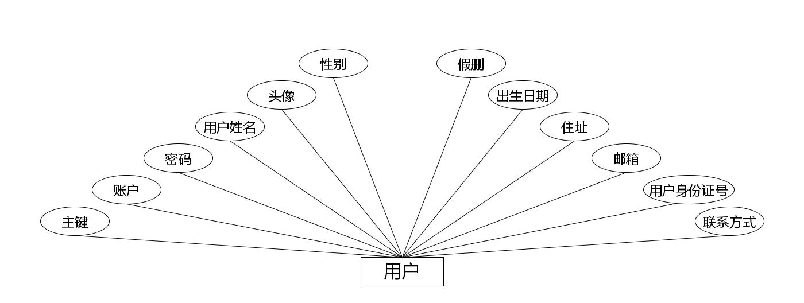

（2）下图是字典表实体和其具备的属性。

图4.2 字典表实体属性图

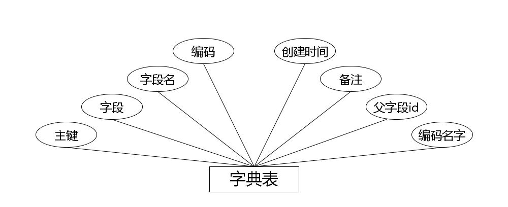

（3）下图是疾病预防实体和其具备的属性。

图4.3 疾病预防实体属性图

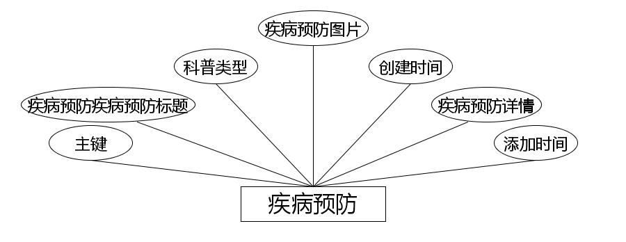

（4）下图是体检项目实体和其具备的属性。

图4.4 体检项目实体属性图

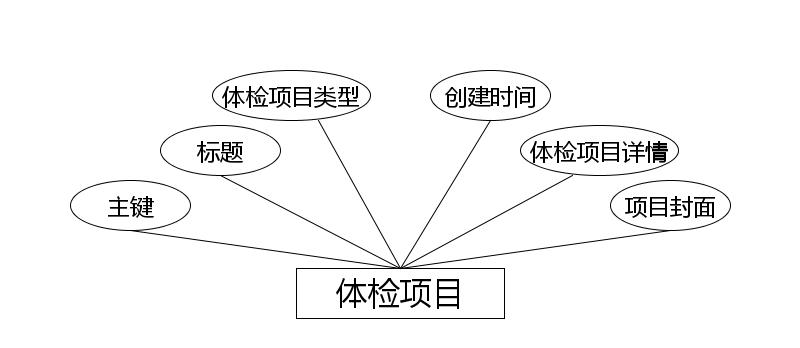

（5）下图是体检提醒实体和其具备的属性。

图4.5 体检提醒实体属性图

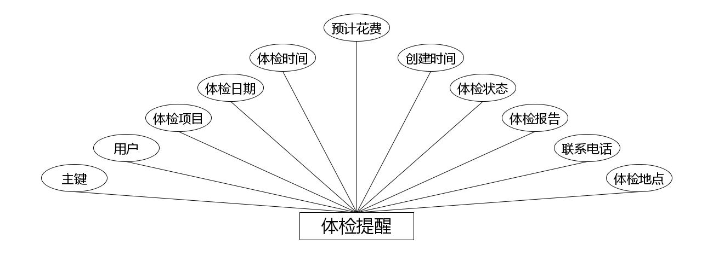

（6）下图是论坛实体和其具备的属性。

图4.6 论坛实体属性图

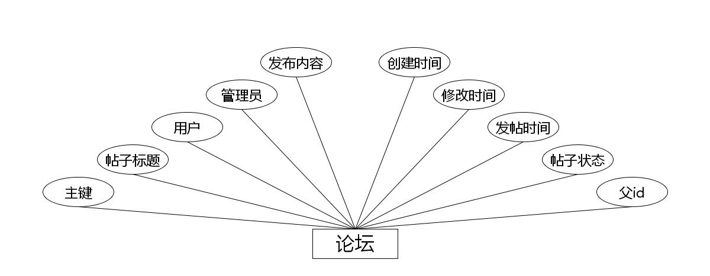

（7）下图是在线咨询实体和其具备的属性。

图4.7 在线咨询实体属性图

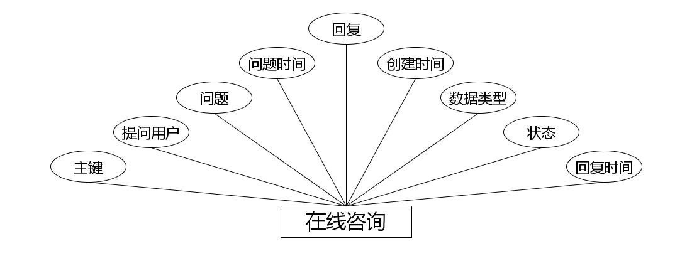

（8）下图是单页数据实体和其具备的属性。

图4.8 单页数据实体属性图

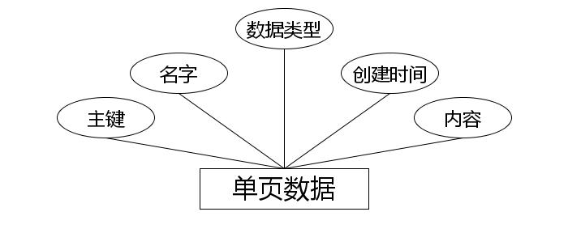

（9）下图是健康常识实体和其具备的属性。

图4.9 健康常识实体属性图

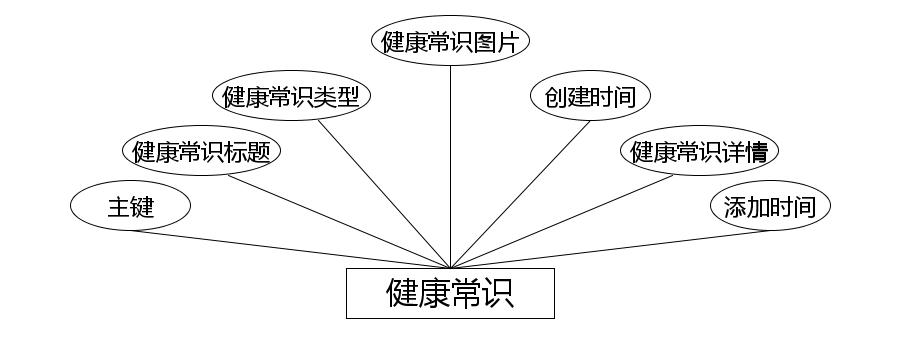

（10）下图是用户表实体和其具备的属性。

图4.10 用户表实体属性图

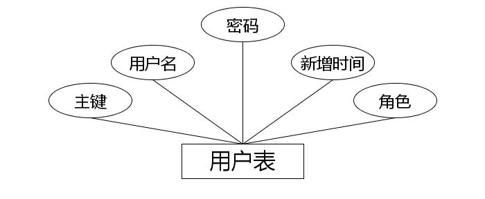

（11）下图是体检项目预约实体和其具备的属性。

图4.11 体检项目预约实体属性图

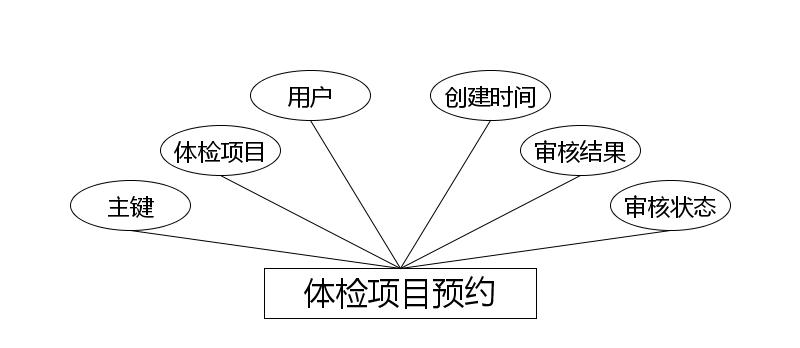

4.3.2 数据库物理设计

本数据库是关系型数据库，因此对二维表的结构设计也比较关键。毕竟二维表格模型就是关系型数据库中的关系模型。而一些常用的关系模型中的概念也需要了解，才可以对关系模型进行设计。下面就简单介绍关系，元组，属性，域，关键字等常用概念的含义。

关系：关系就是数据库中的一张数据表，每张数据表都有命名，也就是每个关系也有名字，那就是数据表名；

元组：元组就是数据表中的一行记录；

属性：属性就是数据表中的字段，也就是数据表中的一列；

域：域就是对数据表中属性的取值进行限定；

关键字：关键字就是数据表中的主键；

在了解了表结构设计的常用概念后，接下来就需要使用前面绘制的E-R模型完成表结构的设计工作，并在数据库中创建数据表，并为各个数据表进行命名。以下就对设计的结果通过表格形式进行展示。

表4.1在线咨询表

表4.2字典表表

表4.3论坛表

表4.4健康常识表

表4.5疾病预防表

表4.6单页数据表

表4.7体检提醒表

表4.8体检项目表

表4.9体检项目预约表

表4.10用户表

表4.11用户表表

5.1用户信息管理

如图5.1显示的就是用户信息管理页面，此页面提供给管理员的功能有：用户信息的查询管理，可以删除用户信息、修改用户信息、新增用户信息，

还进行了对用户名称的模糊查询的条件

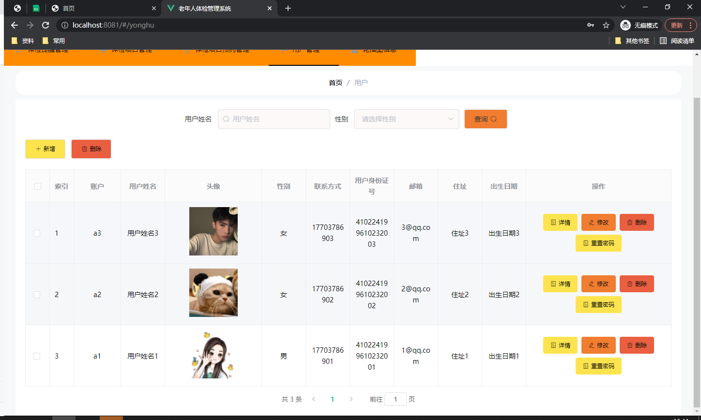

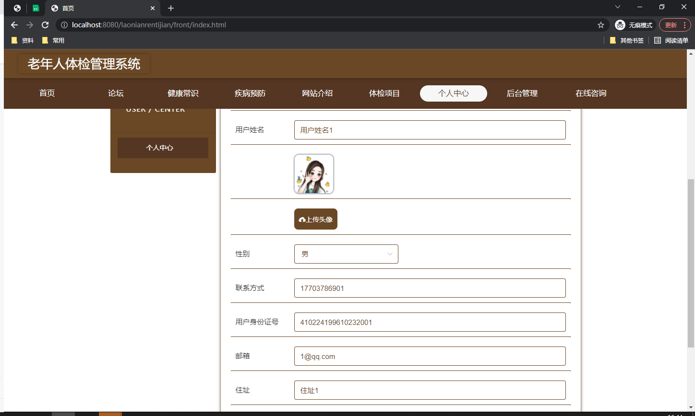

图5.1 用户信息管理页面

5.2 体检项目管理

如图5.2显示的就是体检项目管理页面，此页面提供给管理员的功能有：查看已发布的体检项目数据，修改体检项目，体检项目作废，即可删除，还进行了对体检项目名称的模糊查询 体检项目信息的类型查询等等一些条件。

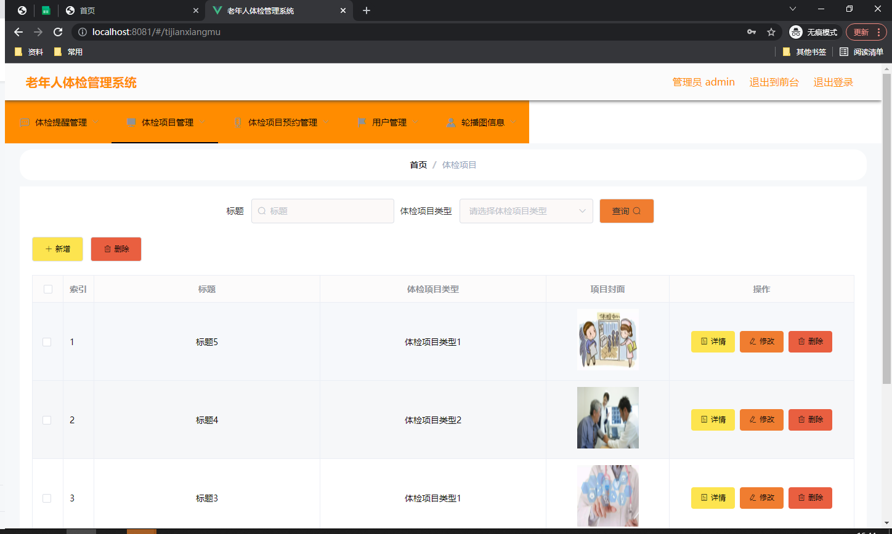

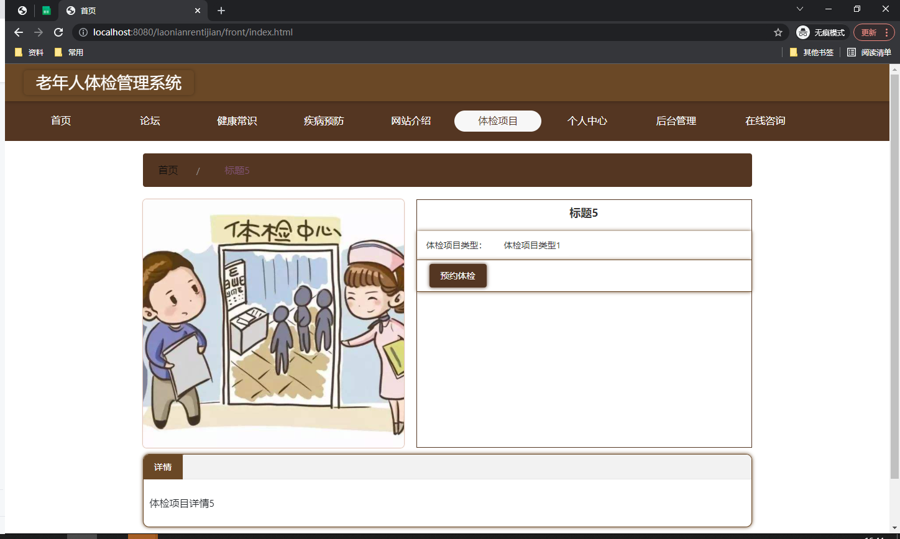

图5.2 体检项目管理页面

5.3项目类型管理

如图5.3显示的就是项目类型管理页面，此页面提供给管理员的功能有：根据项目类型进行条件查询，还可以对项目类型进行新增、修改、查询操作等等。

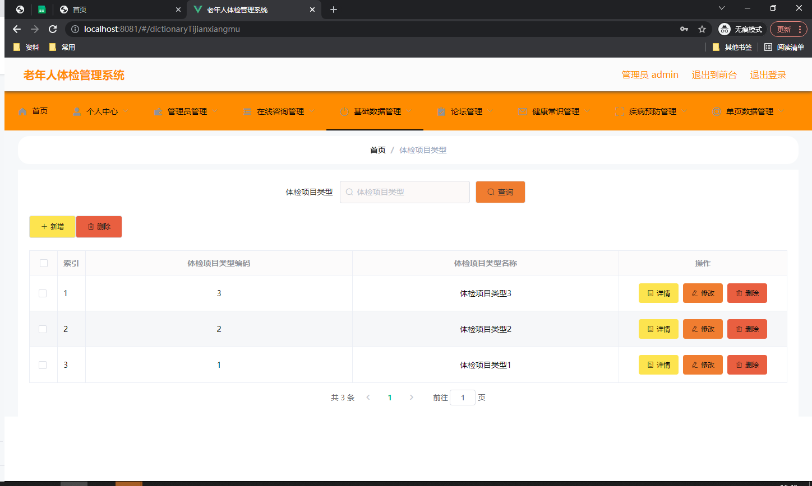

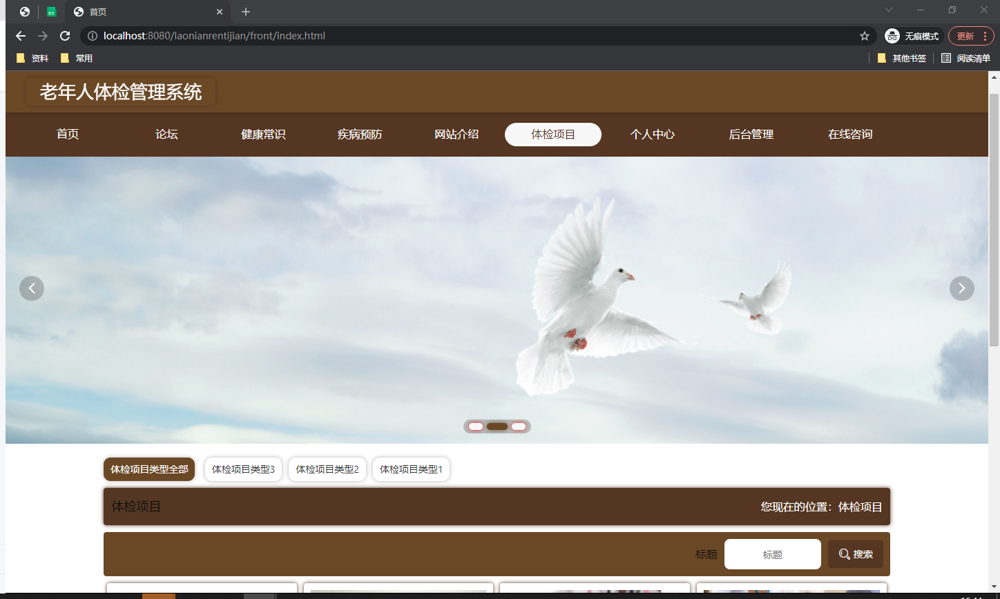

图5.3 项目类型管理页面

5.1健康常识管理

如图5.4显示的就是健康常识管理页面，此页面提供给管理员的功能有：根据健康常识进行新增、修改、查询操作等等。

图5.4 健康常识管理页面

